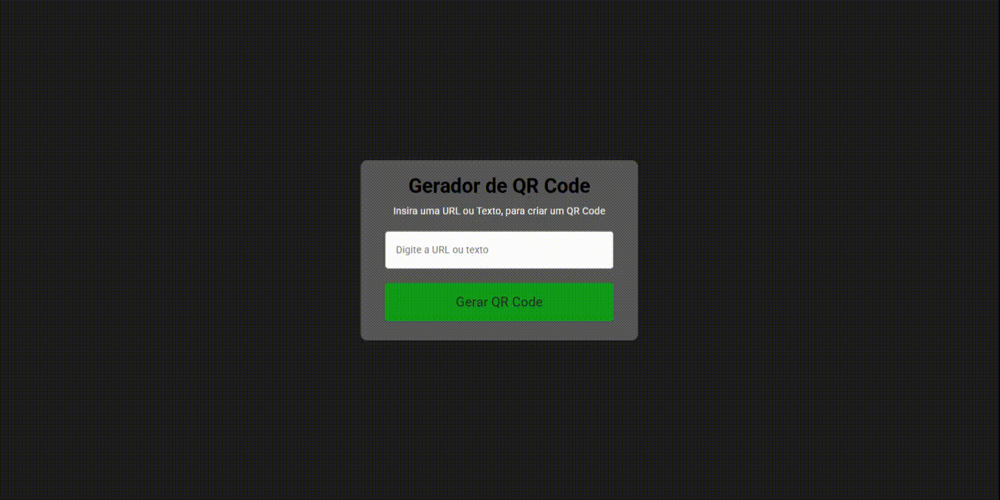

# Custom QR Code Generator

This project is a simple web page that allows the user to input text or a link and generate a corresponding QR Code in real-time.

## Features

- User text input (text or URL).
- Dynamic QR Code generation.
- Immediate visualization of the code on screen.
- Easy to use with no heavy dependencies.

## Technologies Used

- HTML5
- CSS3
- JavaScript
- QR Code generation API `goqr.me`

### Demo

## How to Use
Acces the link:`https://gabmajeau.github.io/QRCode-Generator/`

## Project Structure

/index.html # Main page with the QR Code generator
/script.js # JavaScript code that generates the QR Code
/style.css # Optional styling for the interface

## Notes

- The project does not store data or track access.
- It can be used offline if the QR Code API is replaced with a local library.

